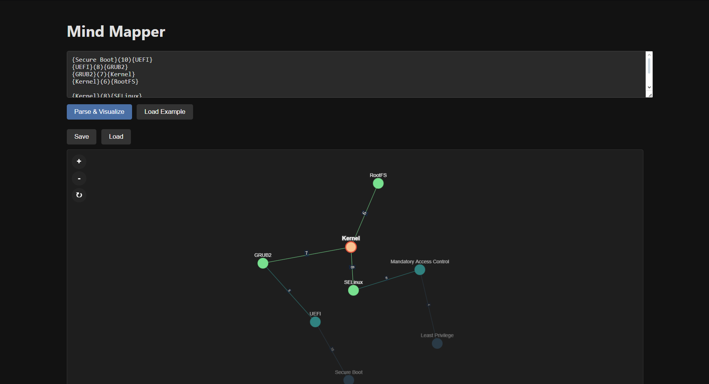

# Mind-Mapper

A visual idea-mapping tool that allows you to create and visualize connections between concepts using a simple custom syntax.



## Features

- **Custom Syntax Parsing**: Define nodes and connections using a simple syntax
- **Interactive Visualization**: Force-directed graph visualization of your ideas
- **Smart Layout**: Automatically positions important nodes more centrally
- **Cascading Highlighting**: When selecting a node, see connections up to 3 degrees away with decreasing intensity
- **Enhanced Weight Visualization**: Edge thickness and color intensity reflect connection strength
- **Dark Theme**: Easy on the eyes for long brainstorming sessions
- **Save & Load**: Persist your mind maps as JSON files

## Installation

1. Clone the repository:
   ```bash
   git clone https://github.com/yourusername/mind-mapper.git
   cd mind-mapper
   ```

2. Install dependencies:
   ```bash
   npm install
   ```

3. Start the development server:
   ```bash
   npm start
   ```

4. Open [http://localhost:3000](http://localhost:3000) in your browser

## How to Use

### Defining Relationships

Use the custom syntax in the input area:

```
{Concept A}(weight){Concept B}
```

Where:
- `Concept A` and `Concept B` are the ideas you want to connect
- `weight` is a number from 1-99 representing the strength of the connection

Example:
```
{toxic shame}(08){addictions}
{self-worth}(06){relationships}
{childhood trauma}(09){anxiety}
```

### Visualization Controls

- **Click on nodes** to highlight their connections
- **Click and drag** to move nodes around
- **Scroll/pinch** to zoom in and out
- **Click and drag** empty space to pan the view
- **Double-click** on empty space to reset the view
- **Use buttons** in the top-left corner for zooming in, out, and resetting
- **Click on background** to deselect

### Smart Layout Algorithm

The visualization uses an intelligent layout algorithm that:

1. **Calculates Node Importance** based on:
   - Number of connections (degree centrality)
   - Total weight of all connections
   - A composite importance score combining these factors

2. **Positions Nodes Strategically**:
   - More important/connected nodes appear more centrally
   - Stronger connections (higher weight) have shorter edge lengths
   - Less connected "leaf" nodes move to the periphery

### Cascading Highlighting

When selecting a node:
- The selected node is highlighted in orange
- Direct connections (1st degree) are highlighted in bright green
- 2nd-degree connections (connections of connections) appear in teal with reduced opacity
- 3rd-degree connections appear in blue with even lower opacity

This creates a visual "ripple effect" showing the node's sphere of influence within the graph.

### Enhanced Weight Visualization

Connection weights are visually represented through multiple cues:
- Edge thickness scales with connection weight
- Edge color intensity corresponds to weight (stronger = brighter)
- Weight values are displayed directly on edges 

### Saving and Loading

- Click **Save** to download your mind map as a JSON file
- Click **Load** to import a previously saved mind map

## Project Structure

```
mind-mapper/
├── public/                 # Static files
│   ├── index.html          # Main HTML template
│   ├── favicon.ico         # Browser icon
│   ├── manifest.json       # Web app manifest
│   └── robots.txt
├── src/
│   ├── components/          # React components
│   │   ├── GraphVisualization.js
│   │   ├── GraphVisualization.css
│   │   ├── InputPanel.js
│   │   ├── InputPanel.css
│   │   ├── InfoBar.js
│   │   └── InfoBar.css
│   ├── modules/             # Core functionality
│   │   ├── Parser.js
│   │   └── GraphModel.js
│   ├── utils/               # Helper functions
│   │   └── fileUtils.js
│   ├── App.js               # Main application component
│   ├── App.css
│   ├── index.js
│   └── index.css
└── package.json
```

## Technologies Used

- **React**: Frontend framework
- **Cytoscape.js**: Graph visualization library
- **File-Saver**: For saving files to the local system

## Custom Syntax Details

The Mind-Mapper uses an undirected graph model with weighted edges:

- All connections are bidirectional
- Weights range from 1-99
- Edge thickness visually represents connection strength

Example:
```
{toxic shame}(08){addictions}
```
Creates two nodes "toxic shame" and "addictions" with a strong connection (weight 8).

## Future Enhancements

- Node and edge styling customization
- Visual graph editing (click to add/remove)
- Export as image
- Shareable links
- Multiple maps in projects
- Hierarchical node relationships

## License

MIT License - See LICENSE file for details

## Contributing

Contributions are welcome! Please feel free to submit a Pull Request.

1. Fork the repository
2. Create your feature branch (`git checkout -b feature/amazing-feature`)
3. Commit your changes (`git commit -m 'Add some amazing feature'`)
4. Push to the branch (`git push origin feature/amazing-feature`)
5. Open a Pull Request
